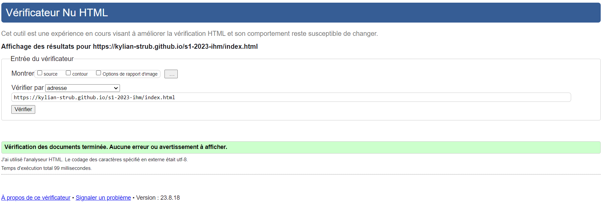
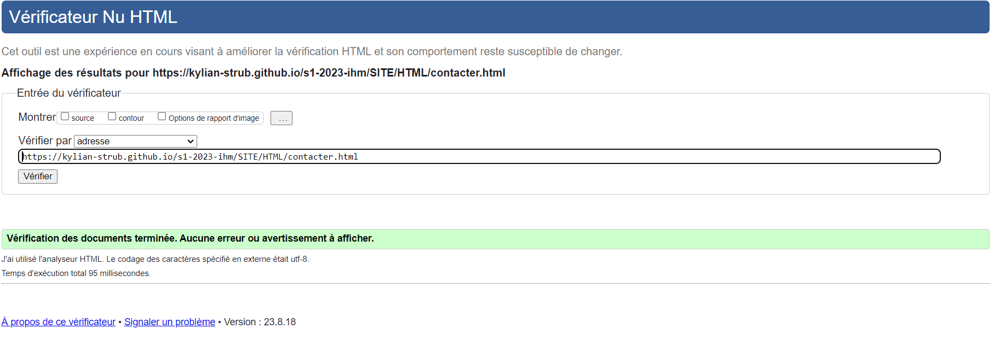
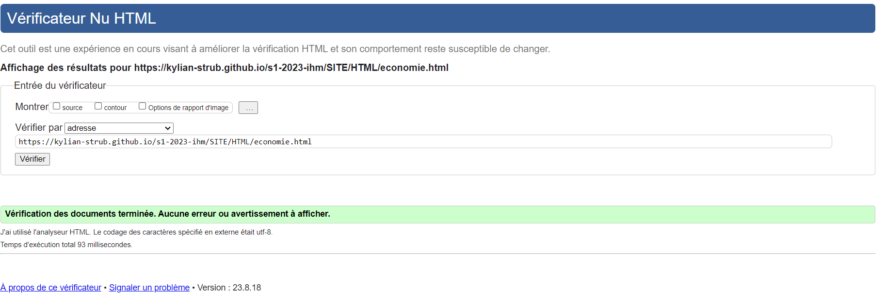
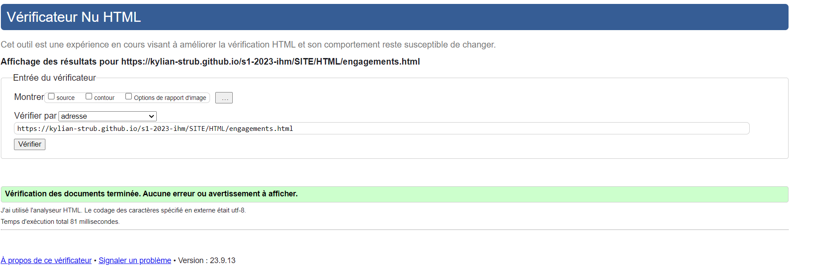
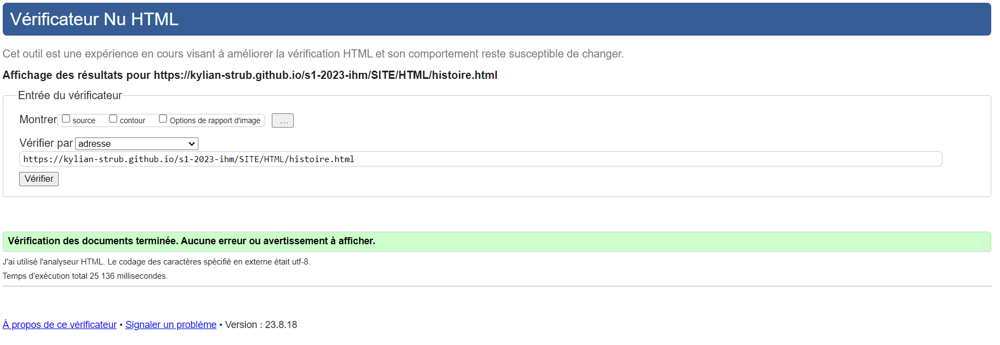
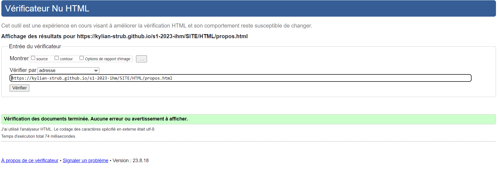

# SAE_1_05_06

## Site sur l'entreprise Orange    

[Lien du site sur l'entreprise Orange](https://kylian-strub.github.io/s1-2023-ihm/)

## Membres du groupe :

Etudiant 1 (référent du groupe) :  [Kylian STRUB - Groupe 1](mailto:kylian.strub@edu.univ-fcomte.fr?subject=SAE_1_05_06)  
Etudiant 2 : [Tim CARRARA](mailto:tim.carrara@edu.univ-fcomte.fr?subject=SAE_1_05_06)   
Etudiant 3 : [Armand MAILLARD](mailto:armand.maillard@edu.univ-fcomte.fr?subject=SAE_1_05_06)  
Etudiant 4 : [Vince HURTAULT](mailto:vince.hurtault@edu.univ-fcomte.fr?subject=SAE_1_05_06)  

# Présentation du projet

Dans notre projet, nous avons créer un site web dédié à Orange, une entreprise leader dans le domaine des télécommunications. 
Notre objectif est de réussir à présenter, au mieux, cette entreprise. Pour se faire, nous organiserons notre site en 7 pages différentes :
## Accueil
Auteur : CARRARA Tim
 
Contenu : Présente l'aspect général du site, en effet, elle est la page de couverture de notre projet qui renvoie aussi sur les autres pages.
 
[Lien W3C](https://validator.w3.org/nu/?doc=https%3A%2F%2Fkylian-strub.github.io%2Fs1-2023-ihm%2Findex.html)
 

## Actualités
Auteur : HURTAULT Vince
 
Contenu : Montre les dernières actualités et informations concernant l'entreprise.
 
[Lien W3C](https://validator.w3.org/nu/?doc=https%3A%2F%2Fkylian-strub.github.io%2Fs1-2023-ihm%2FSITE%2FHTML%2Factualites.html)
 

## Contacter
Auteur : CARRARA Tim
 
Contenu : regroupe les contact et différents réseaux sociaux de l'entreprise.
 
[Lien W3C](https://validator.w3.org/nu/?doc=https%3A%2F%2Fkylian-strub.github.io%2Fs1-2023-ihm%2FSITE%2FHTML%2Fcontacter.html)
 

## Economie
Auteur : MAILLARD Armand
 
Contenu : Présente des informations et des statistiques qui présentent l'entreprise sur le plan économique.
 
[Lien W3C](https://validator.w3.org/nu/?doc=https%3A%2F%2Fkylian-strub.github.io%2Fs1-2023-ihm%2FSITE%2FHTML%2Feconomie.html)
 

## Engagements
Auteur : STRUB Kylian
 
Contenu : Regroupe des informations concernant les activités de l'entreprise et des engagements qui y sont liés.
 
[Lien W3C](https://validator.w3.org/nu/?doc=https%3A%2F%2Fkylian-strub.github.io%2Fs1-2023-ihm%2FSITE%2FHTML%2Fengagements.html)
 

## Histoire
Auteur : MAILLARD Armand 
 
Contenu : Contient des informations sur les événements marquant de l'entrerise à l'aide d'une frise chronologique.
 
[Lien W3C](https://validator.w3.org/nu/?doc=https%3A%2F%2Fkylian-strub.github.io%2Fs1-2023-ihm%2FSITE%2FHTML%2Fhistoire.html)
 

## A propos
Auteur : HURTAULT Vince
 
Contenu : Présente le personnel.
 
[Lien W3C](https://validator.w3.org/nu/?doc=https%3A%2F%2Fkylian-strub.github.io%2Fs1-2023-ihm%2FSITE%2FHTML%2Fpropos.html)
 

# Conclusion

Nous désirons réaliser un site bien construit avec une réelle identité graphique qui en ressort.
Cette dernière sera d’ailleurs basée sur des thèmes modernes, aérés et épurés.
Cela donne donc un site complet mais aussi facile d’utilisation où on ne s’y perd pas comme dans certains sites qui nous submerge d’informations.

